# ⚡ Diseño Electrónico y PCB - T.A.I.L.S.

Este directorio contiene todo el proyecto de diseño de hardware (Hardware Design) de la placa de control principal para el brazo robótico T.A.I.L.S. 

El diseño fue realizado íntegramente en **KiCad**, buscando crear un placa base robusta que elimine el cableado protoboard, minimice el ruido eléctrico y centralice el control de potencia y señales.

---

## 📐 Diagrama Esquemático

El cerebro de la placa es un microcontrolador **STM32F103C8T6 (Bluepill)**. El circuito está dividido en bloques funcionales para facilitar su análisis y mantenimiento:

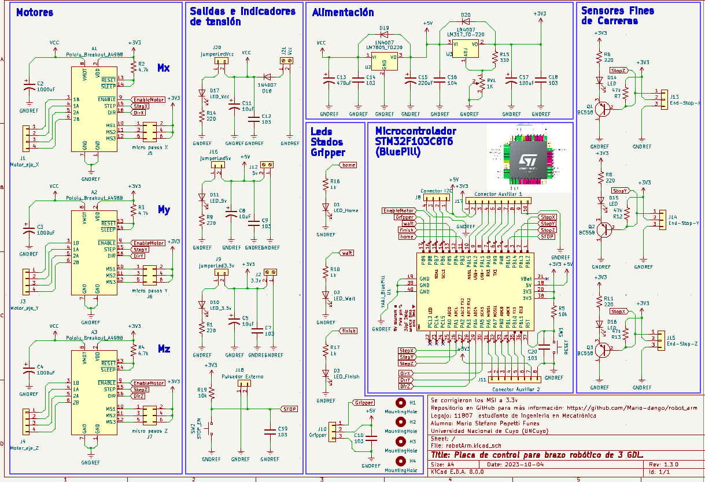

### 🧠 Bloques Principales:
1. **Controlador STM32F103C8T6:** Se utiliza cómo nucleo crentral una placa de desarrollo bluepill con el *STM32F103C8T6* cómo microcontrolador principal.

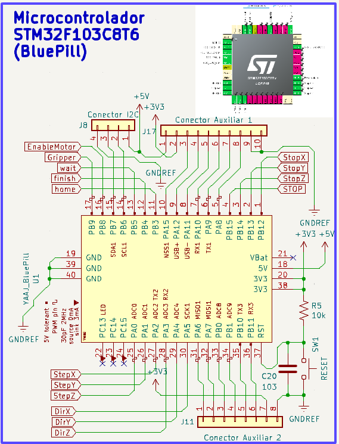

2. **Control de Motores (Ejes X, Y, Z):** Se implementaron 3 zócalos para drivers de motores paso a paso **Pololu A4988**, incluyendo configuración de micro-pasos (MS1, MS2, MS3) y filtrado capacitivo en la alimentación de potencia.

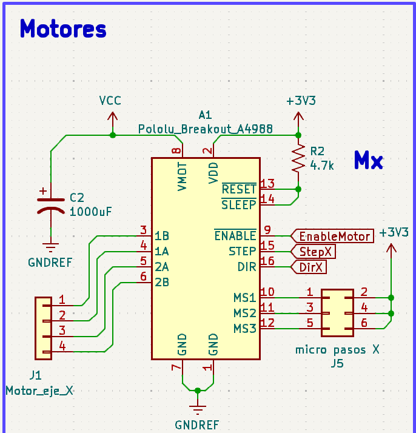

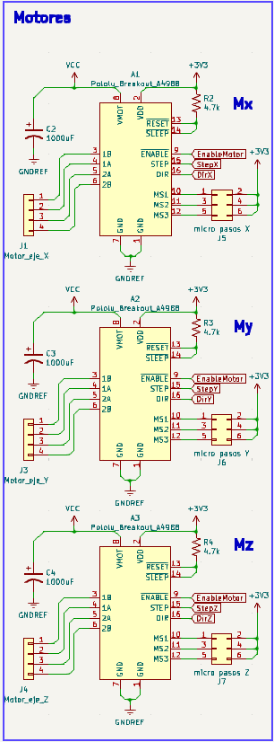

3. **Acondicionamiento de Sensores:** Entradas para 3 finales de carrera (End-Stops). Utiliza transistores PNP (**BC558**) para adaptar y proteger las señales lógicas de 3.3V que van hacia el STM32.

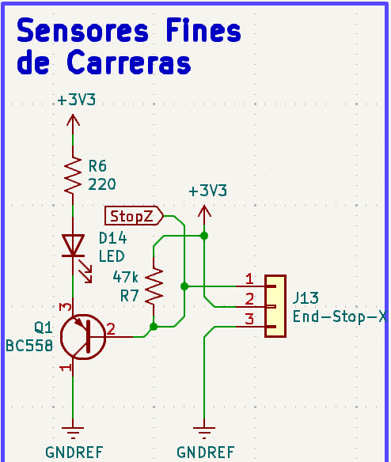
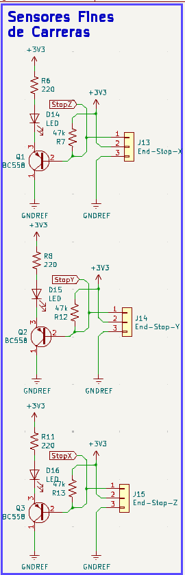
4. **Gestión de Energía:** Etapa de regulación dual. A partir de la tensión de entrada principal (VCC), se extraen **5V** a través de un regulador lineal `LM7805` (para los servos y lógica general) y **3.3V** mediante un regulador ajustable `LM317` (para el STM32 y lógica de sensores).

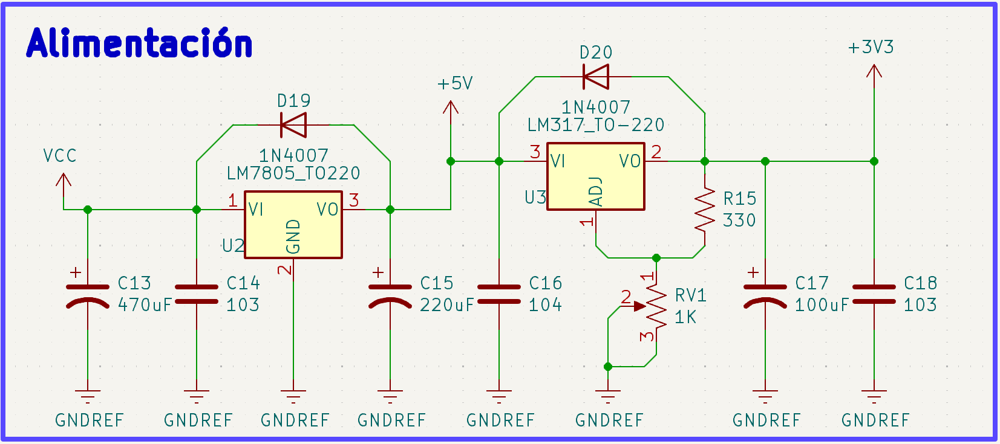
5. **Interfaz de Usuario y Salidas:** * LEDs indicadores de estado (`HOME`, `WAIT`, `FINISH`).
   * LEDs testigos de tensión (`VCC`, `5V`, `3.3V`).

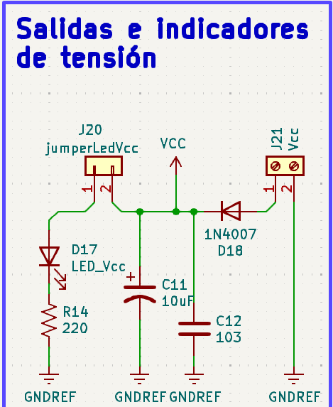
   * Salida PWM dedicada de 5V para el actuador final (Gripper / Servo).
   * Botón de Parada de Emergencia externo (E-STOP).
   
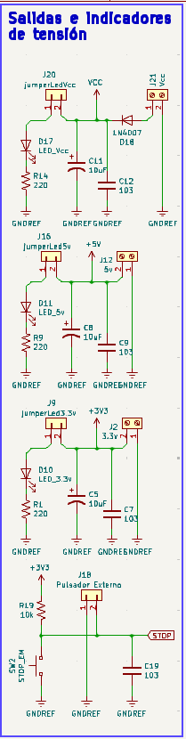
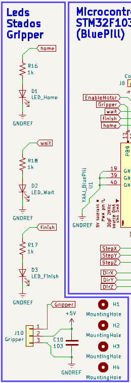

---

## 🛤️ Diseño de la Placa (Layout)

*(Aquí puedes colocar una captura del layout 2D de KiCad, mostrando el ruteo de las pistas)*
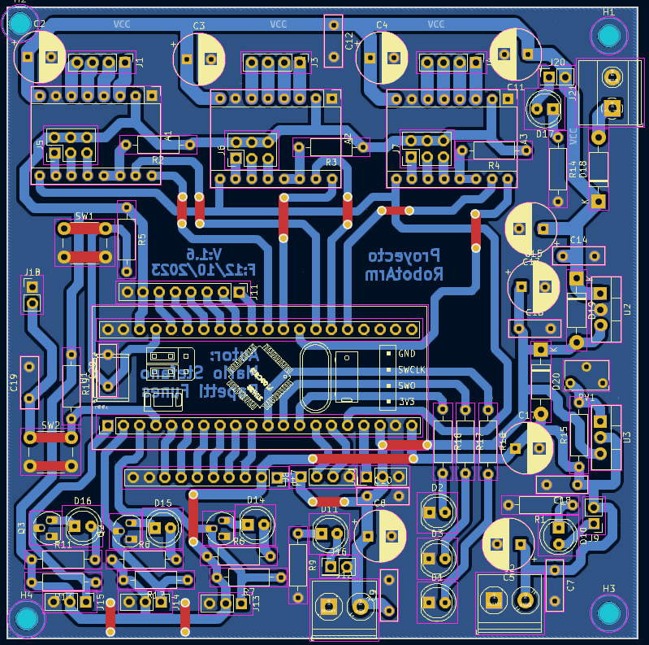

### Consideraciones de Diseño:
* **Planos de Masa (GND Copper Pours):** Se implementaron polígonos de masa para disipar calor y aislar el ruido de la etapa de conmutación de los motores.
* **Trazas de Potencia:** Dimensionamiento adecuado de pistas para las líneas de VCC y VMOT de los drivers A4988.
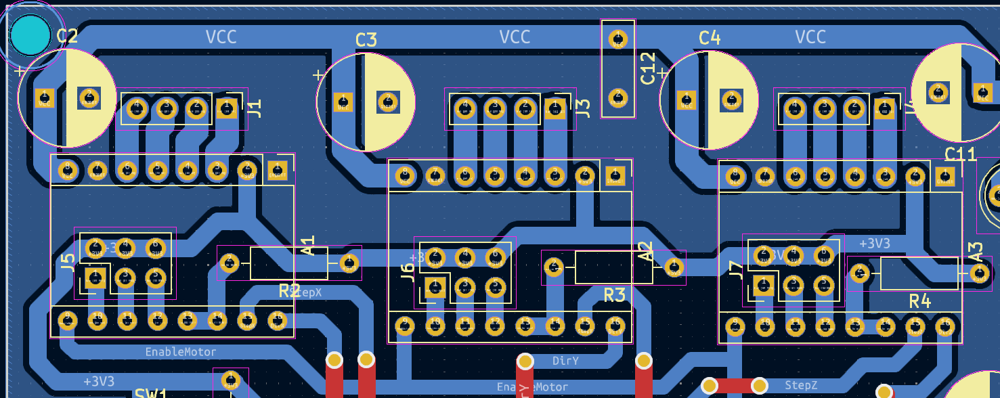

---

## 📦 Modelo 3D

*(Aquí puedes colocar un render 3D exportado directamente desde el visor 3D de KiCad)*
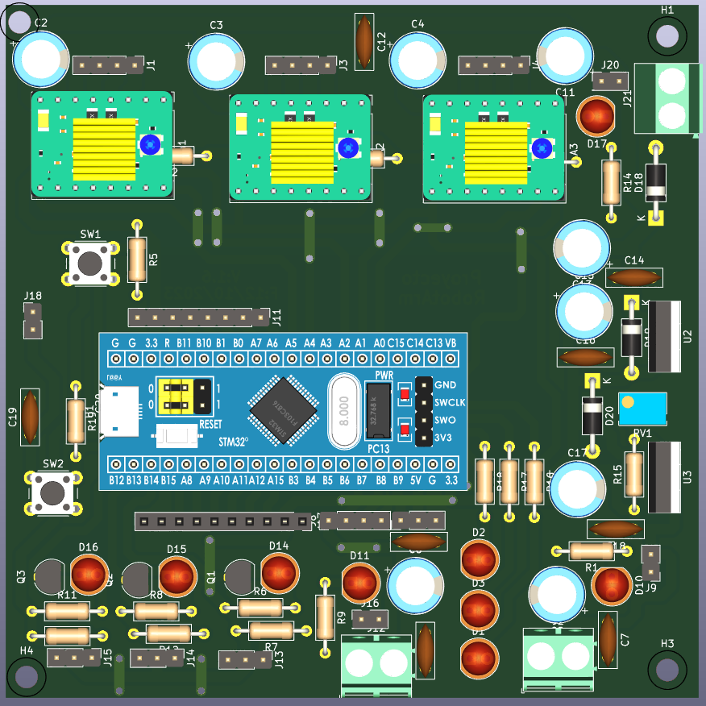

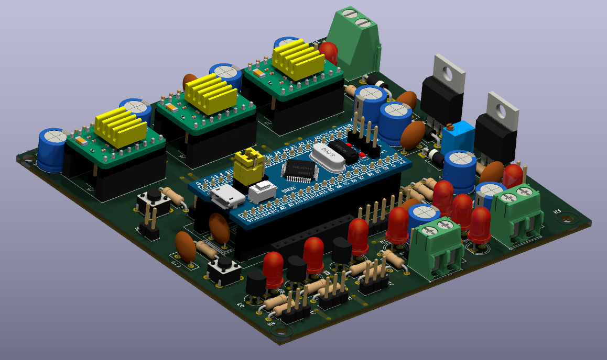
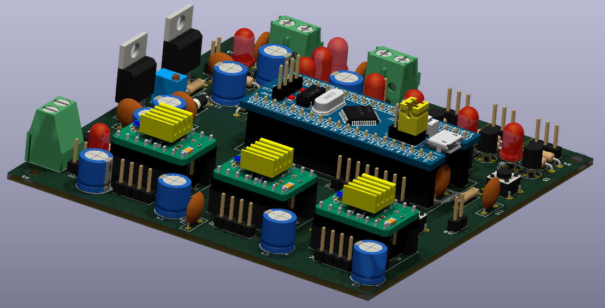
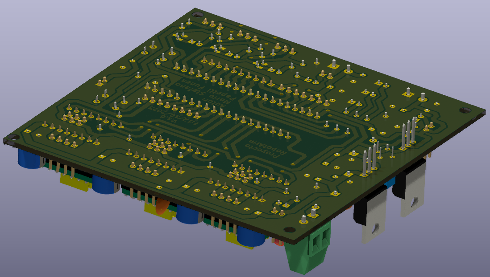
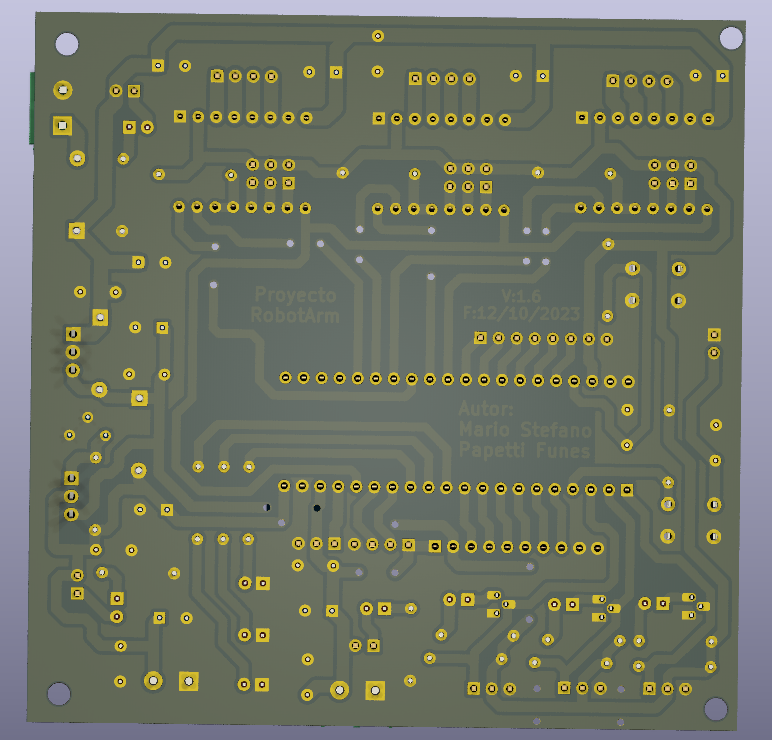
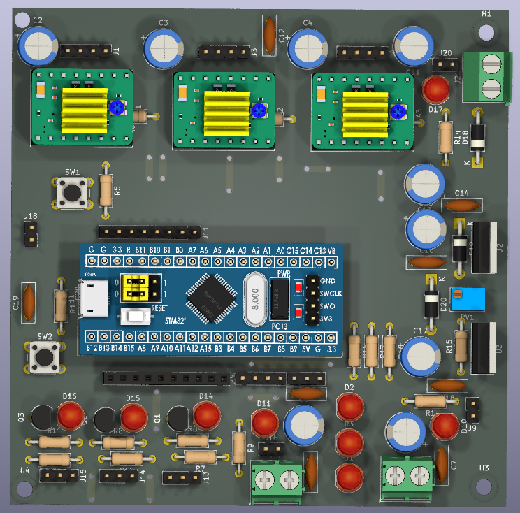

---

## 📋 Lista de Materiales (BOM Principal)
Se puede encontrar dentro de la carpeta [bom](./bom/ibom.html) para completar de forma interactiva y revisar todo acerca de la PCB en cuestión.

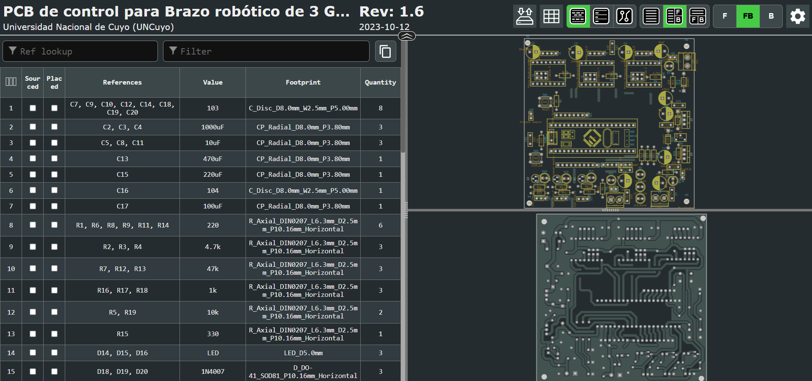
---
*Para editar o visualizar el proyecto completo, abre el archivo `.kicad_pro` en KiCad versión 8.0 o superior.*