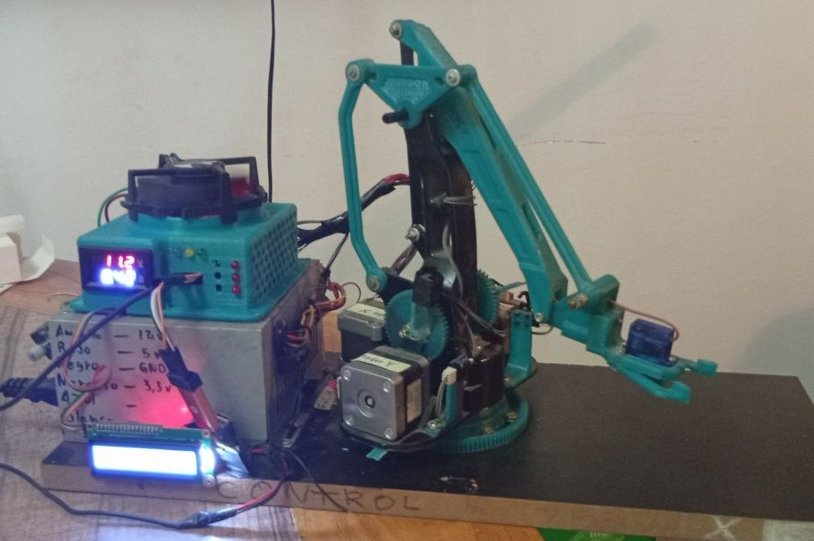
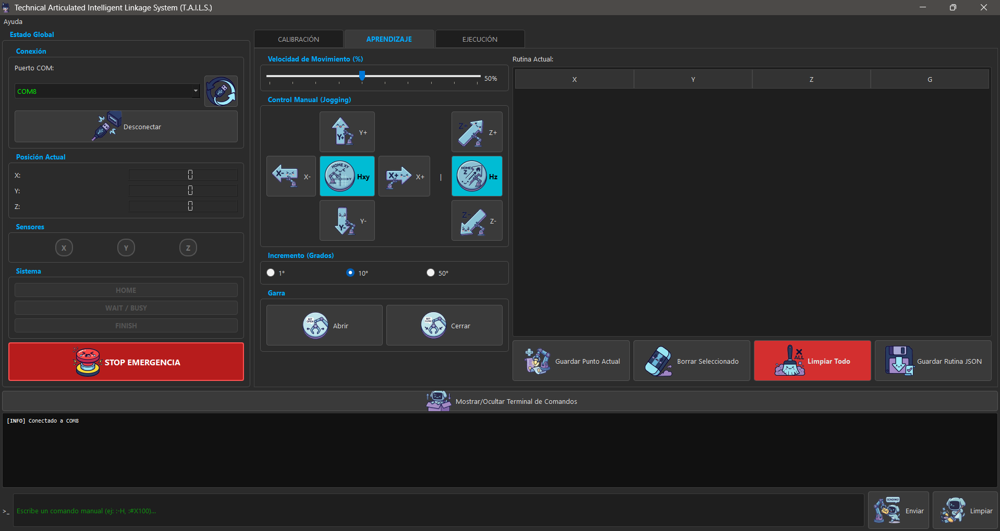

# 🦾 T.A.I.L.S. (Technical Articulated Intelligent Linkage System)


**T.A.I.L.S.** es un ecosistema integral de robótica diseñado para el control, calibración y automatización de un brazo mecánico de 3 Grados de Libertad (3-DOF).

El proyecto fusiona un diseño mecánico impreso en 3D con una electrónica dedicada basada en **STM32** y una interfaz de control de alto nivel desarrollada en **Python (PyQt5)**, permitiendo tanto el teleoperado manual como la ejecución de rutinas de aprendizaje automatizadas.

---

## 📸 Galería del Proyecto

| El Robot (T.A.I.L.S) | La Interfaz de Control |
| :---: | :---: |
|  |  |
| *Vista del ensamblaje mecánico y electrónica* | *Panel de control MVC con visualización de telemetría* |

---

## 🗂️ Arquitectura del Repositorio

El proyecto está organizado modularmente. Haz clic en cada carpeta para ver la documentación técnica detallada:

### 🖥️ [1. Interfaz Gráfica (/interfaz)](./interfaz)
El "cerebro" visual del sistema. Una aplicación de escritorio construida con **Python y PyQt5** bajo el patrón de diseño **MVC (Modelo-Vista-Controlador)**.
* **Características:** Control manual (Jogging), guardado de rutinas en JSON, visualización de sensores en tiempo real y terminal de comandos G-Code.

### ⚡ [2. Firmware (/programa)](./programa)
El código de bajo nivel que reside en el microcontrolador **STM32F103C8T6 (Bluepill)**.
* **Tecnología:** Desarrollado en **STM32CubeIDE** utilizando la librería **HAL**.
* **Funciones:** Generación de pulsos PWM para los servos, lectura de finales de carrera, interpretación de tramas seriales y control de cinemática inversa (en desarrollo).

### 🔌 [3. Diseño Electrónico (/PCB)](./PCB)
Placa de circuito impreso (PCB) personalizada para evitar el cablerío y asegurar conexiones robustas.
* **Herramienta:** Diseñado en **KiCad**.
* **Contenido:** Esquemáticos, vistas 3D de la placa, Gerbers y lista de materiales (BOM).

### 🛠️ [4. Diseño Mecánico (/diseño 3D)](./diseño%203D)
Archivos STL para la impresión 3D de la estructura.
* Incluye los diseños originales (créditos a su autor) y **modificaciones/add-ons personalizados** diseñados específicamente para el proyecto T.A.I.L.S.

### 📚 [5. Documentación (/Documentación)](./Documentación)
Recursos teóricos y técnicos adicionales.
* Datasheets de componentes.
* Informe Técnico del proyecto.
* Manuales de referencia.

---

## 🚀 Instalación y Uso Rápido

### Requisitos Previos
* Python 3.10+
* Librerías: `PyQt5`, `pyserial`

### Ejecución de la Interfaz
1. Clonar el repositorio:
   ```bash
   git clone [https://github.com/Mario-dango/TAILS.git](https://github.com/Mario-dango/TAILS.git)

2. Navegar a la carpeta de la interfaz:
    ```bash
    cd TAILS/interfaz

3. Ejecutar el punto de entrada:
    ```bash
    python main.py

## 🤝 Créditos y Autoría
* **Desarrollador Principal**: [Mario-dango](https://github.com/Mario-dango)
* **Diseño 3D Base**: [Jacklittle](https://www.thingiverse.com/thing:2520572) (ver carpeta diseño 3D para más detalles).
* **Institución**: Universidad Nacional de Cuyo.

---

Hecho con ❤️ y mucho café en Mendoza, Argentina.